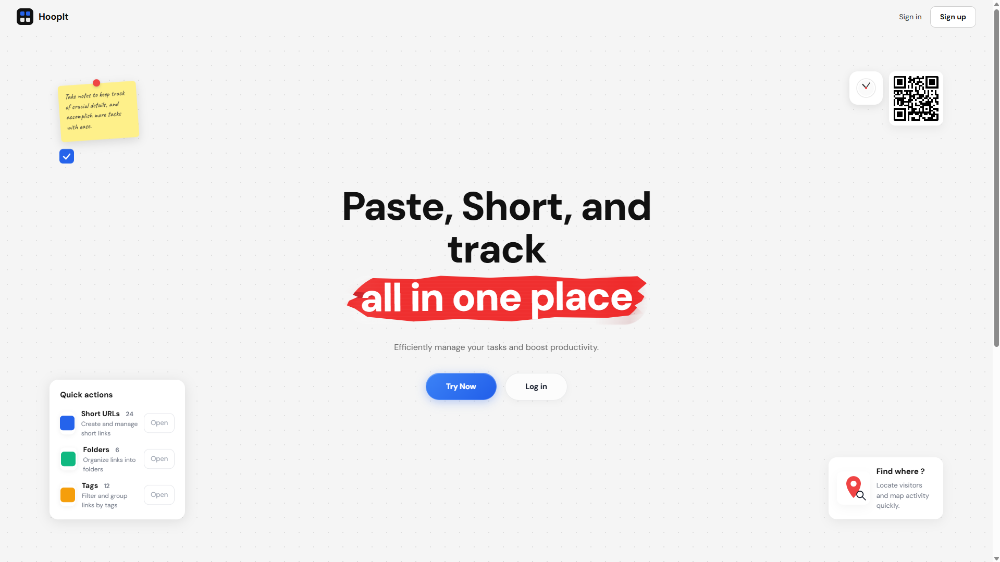

<div align="center">

# 🔗 Hoopit

**A full-stack URL shortener with real-time analytics, folder organization, and geolocation tracking.**

Shorten links, understand your audience, and see exactly who's clicking — from where, on what device, and when.

[](#tech-stack)
[](#tech-stack)
[](#tech-stack)
[](#tech-stack)
[](#license)

[Features](#-core-features) • [Tech Stack](#-tech-stack) • [Getting Started](#-getting-started) • [API Reference](#-api-overview) • [Deployment](#-deployment-notes)

</div>

---

## 📸 Preview

<div align="center">



</div>

---

## ✨ Overview

Hoopit combines a **Node.js + Express** backend with a **React + Vite** frontend to turn long, unwieldy URLs into clean, shareable links — while giving you a full analytics dashboard to track clicks, devices, browsers, referrers, and geolocation in real time.

|  |  |
|---|---|
| 🔗 **Shorten** | Turn long URLs into clean, shareable links with optional custom aliases |
| 📁 **Organize** | Group links into folders for easy management |
| 📊 **Analyze** | Track clicks by device, browser, country, city, referrer, and timestamp |
| 🗺️ **Visualize** | See where your clicks come from on an interactive map |
| 🔐 **Secure** | JWT-based authentication with protected dashboard routes |

---

## 🚀 Core Features

### URL Management
- Create short URLs from long links
- Add optional custom aliases
- Organize links into folders
- Manage active and archived links

### 📊 Analytics
- Total click counts at a glance
- Traffic breakdowns by country, city, device, and browser
- Recent click history log
- Interactive location map powered by Leaflet
- Growth trends and summary charts

### 🌍 Location Tracking
- IP-based geolocation via edge headers or `geoip-lite`
- Optional browser geolocation for higher precision
- Visitor ID tracking to match location updates with click events

### 🔐 Authentication
- User registration and login
- Protected dashboard routes
- Cookie-based session handling with JWT

---

## 🛠 Tech Stack

<table>
<tr>
<td valign="top" width="50%">

**Backend**
- Node.js + Express
- MongoDB + Mongoose
- JWT + `cookie-parser`

</td>
<td valign="top" width="50%">

**Frontend**
- React 19 + Vite
- React Router + Axios
- Tailwind CSS

</td>
</tr>
<tr>
<td valign="top" width="50%">

**Analytics & Location**
- `geoip-lite`
- `UAParser`
- Leaflet / `react-leaflet`

</td>
<td valign="top" width="50%">

**Styling**
- CSS + Tailwind CSS

</td>
</tr>
</table>

---

## 📂 Project Structure

```text
Hoopit/
├── Backend/
│   ├── app.js
│   └── src/
│       ├── config/
│       ├── controller/
│       ├── dao/
│       ├── middleware/
│       ├── models/
│       ├── routes/
│       ├── services/
│       └── utils/
└── Frontend/
    ├── src/
    │   ├── api/
    │   ├── components/
    │   ├── pages/
    │   ├── routings/
    │   └── utils/
    └── public/
```

---

## ⚡ Getting Started

### 1. Clone the repository

```bash
git clone https://github.com/me-sayanghosh/Hoopit
cd Hoopit
```

### 2. Configure the backend

```bash
cd Backend
npm install
```

Create a `.env` file in `Backend/` with the following:

```bash
PORT=5000
MONGO_URI=your_mongodb_connection_string
JWT_SECRET=your_jwt_secret
CLIENT_URL=http://localhost:5173
```

Start the backend:

```bash
npm run dev
```

### 3. Configure the frontend

```bash
cd ../Frontend
npm install
npm run dev
```

Your app should now be running at `http://localhost:5173` 🎉

---

## 📜 Available Scripts

<table>
<tr>
<td valign="top" width="50%">

**Backend**
| Script | Description |
|---|---|
| `npm start` | Start the server with Node.js |
| `npm run dev` | Start the server with nodemon |
| `npm test` | Placeholder test script |

</td>
<td valign="top" width="50%">

**Frontend**
| Script | Description |
|---|---|
| `npm run dev` | Start the Vite dev server |
| `npm run build` | Create a production build |
| `npm run preview` | Preview the production build |
| `npm run lint` | Run ESLint |

</td>
</tr>
</table>

---

## 🔌 API Overview

### Authentication
| Method | Endpoint | Description |
|---|---|---|
| `POST` | `/api/auth/register` | Register a new user |
| `POST` | `/api/auth/login` | Log in a user |
| `POST` | `/api/auth/logout` | Log out the current user |
| `POST` | `/api/auth/refresh` | Refresh the auth token |

### Short URLs
| Method | Endpoint | Description |
|---|---|---|
| `POST` | `/api/create` | Create a new short URL |
| `GET` | `/r/:shortCode` | Redirect to the original URL |
| `GET` | `/api/user/all-urls` | Get all URLs for the current user |
| `GET` | `/api/user/analytics/:shortUrl` | Get analytics for a specific URL |
| `POST` | `/api/create/track-location` | Track visitor location for a click |
| `PUT` | `/api/:id` | Update a short URL |
| `DELETE` | `/api/:id` | Delete a short URL |

### Folders
| Method | Endpoint | Description |
|---|---|---|
| `POST` | `/api/folder` | Create a new folder |
| `GET` | `/api/folder` | Get all folders |
| `PUT` | `/api/folder/:id` | Update a folder |
| `DELETE` | `/api/folder/:id` | Delete a folder |

---

## 🚢 Deployment Notes

- ✅ Use **HTTPS** in production so browser geolocation works correctly
- ✅ Set all backend environment variables before deploying
- ✅ Ensure the frontend API base URL points to the deployed backend
- ✅ Verify MongoDB access and CORS settings in production

---

## 🤝 Contributing

Contributions are welcome! To keep the codebase consistent:

- Follow the existing backend **controller → DAO → service** structure
- Match the existing frontend component layout and styling conventions
- Keep pull requests focused and well-scoped

---

## 📄 License

No license has been specified yet.

---

<div align="center">

Built with ❤️ by [Sayan Ghosh](https://github.com/me-sayanghosh)

</div>